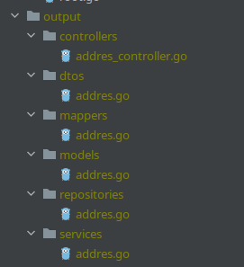

# apigen

[](https://github.com/vinshop/apigen/actions)

### Generate API structure for table from Database
#### Install
`
go install github.com/vinshop/apigen@v1.0
`
#### Usage
```
Generate golang api structure

Usage:
  version gen [flags]

Flags:
      --controller string   controllers folder (default "controllers")
      --db string           db name (default "db_name")
      --dto string          dtos folder (default "dtos")
  -h, --help                help for gen
      --host string         db host (default "localhost")
      --mapper string       mappers folder (default "mappers")
      --model string        models folder (default "models")
      --out string          output folder (default "output")
      --pass string         db pass (default "secret")
      --port int32          db port (default 3306)
      --repo string         repositories folder (default "repositories")
      --service string      services folder (default "services")
      --table string        db name (default "table_name")
      --type string         db type: mysql, postgres (default "mysql")
      --user string         db user (default "root")
```
#### Example
```
apigen gen --host localhost --port 3306 --user root --pass root --db my_db --table address
```
#### Result


